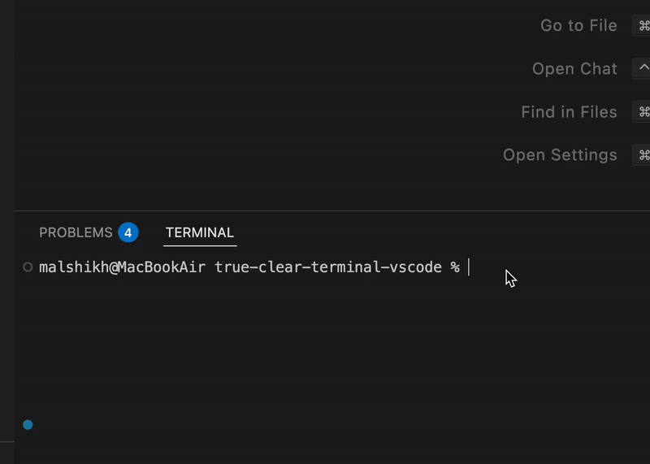

# True Clear Terminal

This extension clears the currently focused terminal as well as its scrollback buffer, unlike the built-in `Terminal: Clear` command which only hides the output. That solves the issue with old commands showing up suddenly while typing.


## Features

- **True terminal clearing**: Completely clears the terminal screen and cancels any current input
- **Cross-platform**: Works on Windows (PowerShell, CMD) and macOS/Linux (Unix terminals)



## Usage

### Method 1: Keyboard Shortcut
- Press `Ctrl+Shift+K` to clear the active terminal

### Method 2: Command Palette
1. Open Command Palette (`Ctrl+Shift+P` / `Cmd+Shift+P`)
2. Type `True Clear Terminal`
3. Press Enter

## Supported Terminals

✅ **Supported:**
- Windows PowerShell
- Windows Command Prompt (CMD)  
- macOS Terminal (bash, zsh)
- Linux Terminal (bash, zsh, etc.)

❌ **Not Currently Supported:**
- Git Bash

## Installation

### From VS Code Marketplace
1. Open VS Code
2. Go to Extensions (`Ctrl+Shift+X`)
3. Search for "True Clear Terminal"
4. Click Install

### For Development

#### Requirements

- **Node.js**: Version 20.18.2 or higher
- **VS Code**: Version 1.102.0 or higher

```bash
# Clone the repository
git clone https://github.com/mohammadalshikh/true-clear-terminal-vscode.git
cd true-clear-terminal-vscode

# Install dependencies
npm install

# Build the extension
npm run compile
code .

# Test in VS Code (Press F5 to launch Extension Development Host)
```

## Release Notes

### 0.0.1
- Initial release
- Cross-platform terminal clearing
- Support for Windows (PowerShell, CMD) and Unix systems

### 0.0.2
- Adding demo
- Updating description

## License

MIT - [LICENSE](LICENSE)
